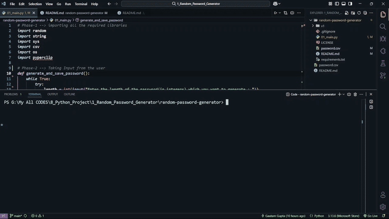

# 🔐Advanced Random Password Generator

[](LICENSE)


**A command-line-tool to generate strong and flexible passwords with a secure, local storage system for multiple users.**

This project started as a personal challenge to build a useful tool entirely from scratch. My goal was to move beyond following step-by-step video tutorials and instead rely on my own problem-solving skills, using official documentation and focused research to overcome obstacles. Everything you see here, from the application's architecture to the user interface, is my own work—the result of curiosity and a lot of trial-and-error.

---

## 🚀 Features

### 🔐 Build Strong, Custom Passwords
- Pick exactly how long you want your password to be.
- Choose which character types to include:
  - Numbers (0–9)
  - Lowercase letters (a–z)
  - Uppercase letters (A–Z)
  - Special symbols (!@#$…)
- Option to make sure there’s at least one of *each* type you select.
- The final password gets fully shuffled for extra randomness.
- Instantly copied to your clipboard so you can paste it anywhere.

---

### 🗄️ Manage Multiple Users & Logins Easily
- Saves credentials in a neat, easy-to-read **passwords.csv** file.
- Supports multiple users, so you can keep track of who owns which accounts.
- Quick, menu-driven search to instantly find any saved password.

---

## 📷Demo



---

## Installation

To get a local copy up and running, follow these simple steps.

1.  **Prerequisites**
    * Python 3.10 or higher

2.  **Clone the Repository**
    ```sh
    git clone https://github.com/MrHacker2006/advanced-random-password-generator.git
    ```

3.  **Navigate and Set Up Environment**
    ```sh
    cd advanced-random-password-generator
    python -m venv v1
    source v1/bin/activate  # On Windows use: v1\Scripts\activate
    ```

4.  **Install Dependencies**
    ```sh
    pip install -r requirements.txt
    ```

## Usage

Run the application from your terminal after installation:

```sh
python 01_main.py
```
The program will launch a user-friendly interactive menu. Simply follow the on-screen prompts to either generate a new password or retrieve a previously saved one.

---

## 🛣️Roadmap 

- Develop a full-stack web application version of this tool.

- Add functionality to edit or delete existing password entries.

- Implement a password strength analysis feature.

---

## 📜 License

Distributed under the MIT License. See [MIT LICENSE](LICENSE) for more information.

---

